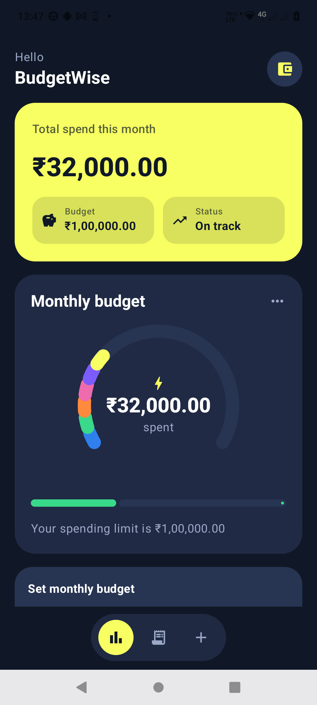
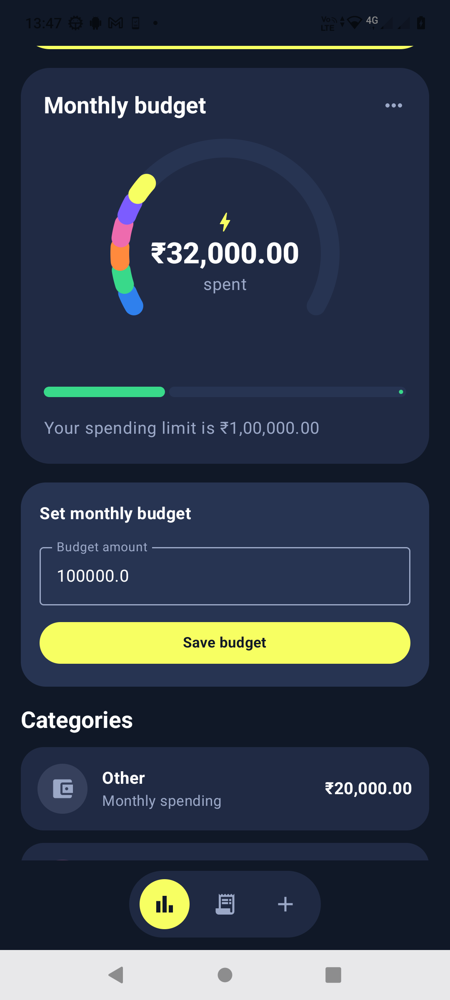
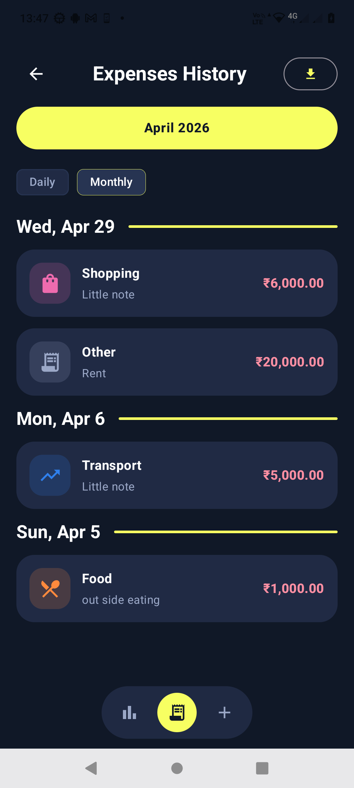
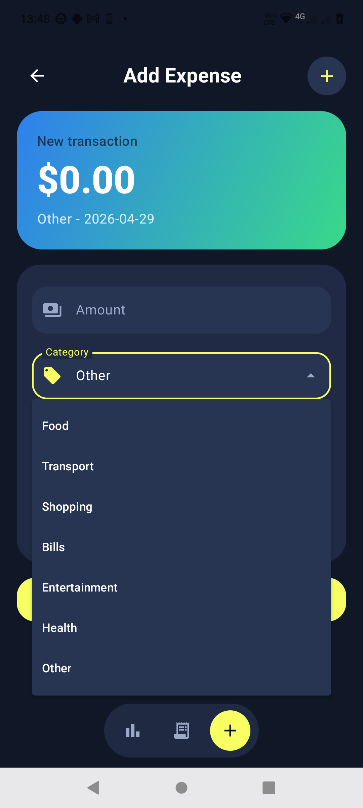
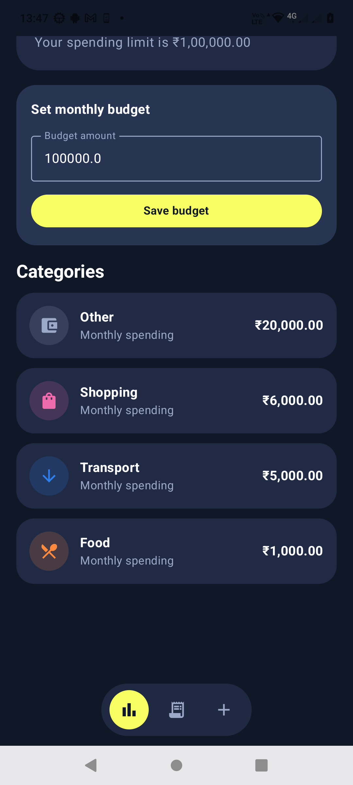
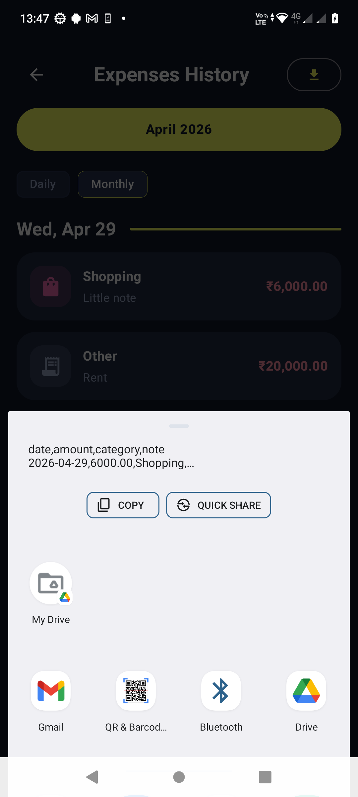

# BudgetWise

BudgetWise is a modern Android expense tracker built with Kotlin, Jetpack Compose, MVVM, StateFlow, Room, and Hilt. It helps users record expenses, review spending history, track monthly budgets, and understand category-wise spending through a polished finance-dashboard UI.

## Project Summary

The app follows a clean architecture style with separate `data`, `domain`, and `ui` layers. Expenses are stored locally with Room, exposed through repository interfaces and use cases, then rendered in Compose screens using ViewModels and StateFlow.

## Features

- Add expenses with amount, category, note, and date.
- Auto-categorize expenses from notes:
  - `food` -> Food
  - `uber` -> Transport
  - `amazon` -> Shopping
- Store expenses locally using Room Database.
- View expenses grouped by date.
- Filter expenses by daily or monthly view.
- Dashboard with monthly spending summary.
- Category breakdown with visual chart-style UI.
- Monthly budget setup.
- Budget exceeded warning.
- Export filtered expense list as CSV using Android share.
- Modern Material 3 dark finance UI.

## Tech Stack

- Kotlin
- Jetpack Compose
- Material 3
- MVVM Architecture
- Clean Architecture
- StateFlow
- Coroutines
- Room Database
- Hilt Dependency Injection
- Navigation Compose
- Gradle Kotlin DSL

## Screenshots

### Demo

[Watch app recorder](screenshots/bugetwise_recorder.mp4)

### Gallery

| Dashboard | Dashboard Budget | Expense History |
| --- | --- | --- |
|  |  |  |

| Add Expense | Expense Detail | Share Export |
| --- | --- | --- |
|  |  |  |
## How To Run

1. Open Android Studio.
2. Select **Open** and choose:

   ```text
   D:\BudgetWise
   ```

3. Wait for Gradle sync to finish.
4. Select an emulator or connected Android device.
5. Click **Run**.

You can also build from PowerShell:

```powershell
cd D:\BudgetWise
.\gradlew.bat :app:assembleDebug
```

For a quick Kotlin compile check:

```powershell
cd D:\BudgetWise
.\gradlew.bat :app:compileDebugKotlin
```

## Package Structure

- `app/src/main/java/com/budgetwise/expensetracker/data/db`: Room database, DAO, and entity mapping.
- `app/src/main/java/com/budgetwise/expensetracker/data/repository`: Repository implementations.
- `app/src/main/java/com/budgetwise/expensetracker/di`: Hilt dependency injection modules.
- `app/src/main/java/com/budgetwise/expensetracker/domain/model`: Domain models and enums.
- `app/src/main/java/com/budgetwise/expensetracker/domain/repository`: Repository contracts.
- `app/src/main/java/com/budgetwise/expensetracker/domain/usecase`: Application use cases.
- `app/src/main/java/com/budgetwise/expensetracker/ui/navigation`: Compose navigation graph.
- `app/src/main/java/com/budgetwise/expensetracker/ui/screens`: Compose screens and ViewModels.
- `app/src/main/java/com/budgetwise/expensetracker/ui/theme`: Material 3 theme and colors.


